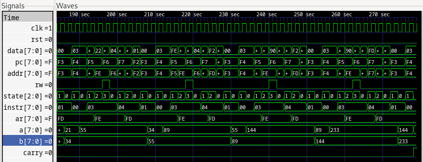

# Simple examples in Verilog

Goal: Ben Eater 8bit breadboard computer on my iCE FPGA

Steps:
  1. Simulations: learn Verilog with `iverilog`
      - ALU thing
      - Memory
      - Bus
      - Decode logic
  2. Real board: configure `Olimexino` board for flashing 

## Verilog tutorials
  1. Set-Reset Flip-Flop

  

  2. 8-bit computer
  
